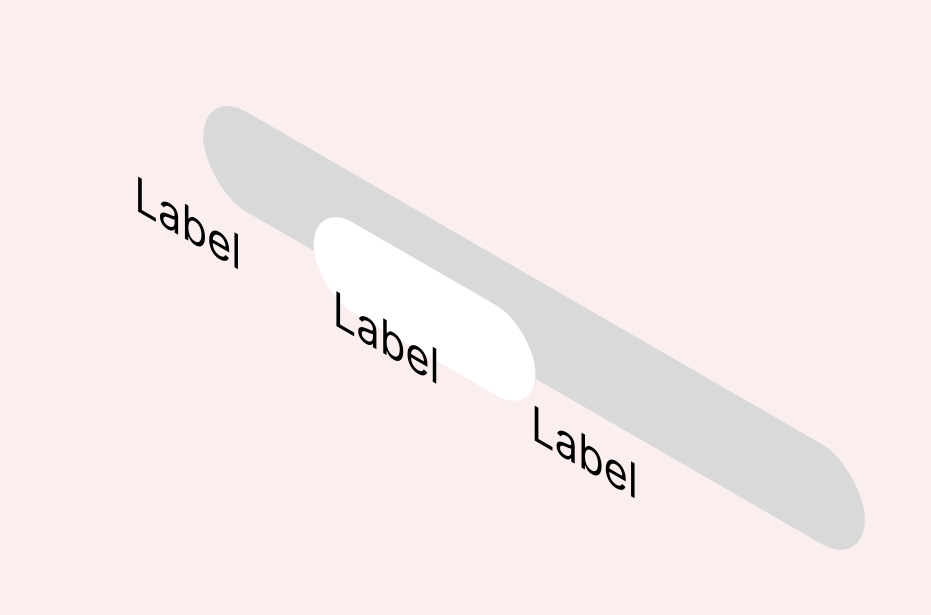

# Тестовое задание

Необходимо переделать компонент TextSwitch что бы он соотвествовал следующим требованиям:

### Переделать текущую реализацию перемещения слайдера между элементами.

Сейчас у компонента в слайдер находится текст, который меняется в зависимости от положения слайдера. Необходимо сделать три слоя: подложка, слайдер без текста, элемент с текстом. Выглядить должно так:


### Расширить количество вариантов.

Сейчас компонент эмулирует поведение checkbox, необходимо добавить возможность использования нескольких значений, компонент должен эмулировать поведение select и возвращать value на события.

```tsx
<TextSwitch>
  <Option value="left">Left</Option>
  <Option value="center">Center</Option>
  <Option value="right">Right</Option>
</TextSwitch>
```

### Размер элементов должен быть динамический и зависить от ширины текста.

Сейчас у компонента фиксированная ширина элемента и слайдера. Нужно сделать что бы ширина элемента зависила от контента, а ширина слайдера соотвественно от активного элемента.

### Совместимость компонента

Компонент должен использоваться как кастомный с библиотеками [formik](https://formik.org/) и [react-form-hook](https://react-hook-form.com/).

## Необязательные задачи.

Ниже необязательные задачи, но если вы их сделаете это будет плюсом.

### Добавить анимацию с spring

Можно добавить анимацию перемещения слайдера между элементами с помощью [GSAP](https://greensock.com/docs/v3/GSAP) или [Frame Motion](https://www.framer.com/motion/)

### Сделать мобильный вариант переключателя.

С большим количеством элементов переключатель не поместиться на мобильных устройствах. Можно придумать и реализовать альтернативный вид (возможно дропдаун или вертикальный переключатель).
